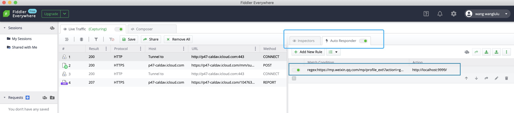

# 使用手册 📚

## 前期准备
1. 微信账户
2. Fiddler Everywhere 账户，[注册账户](https://dashboard.getfiddler.com/login)
3. **禁止**移动微信窗口 / 图标 / 任务栏位置

## 操作
1. 登陆微信并最小化，**禁止移动窗口**
2. 登陆 Fiddler Everywhere 确认`Auto Responder`为开启状态并将其最小化。登陆时等待的时间略长为正常现象
    
3. 双击桌面 run.bat，**会进行自动操作直到自动关闭微信，请勿在此期间操作 Ipad**
4. [查看信息](http://emerge.ltd:10011/)，确认无误点击`提交给远程`。
    

## FAQ

### 无信息获取
查看`Fiddler Everywhere`或`微信`是否登陆失效。

### 当遇到网络或代理问题
`Fiddler Everywhere`在非正常关闭的时候，会保持代理模式。

### 当 `Fiddler Everywhere` 长时间(超过5分钟)维持 Please Wait
* 方法1: 关闭系统设置中的网络代理，重新启动并开启`Auto Responder`
* 方法2: 卸载重装