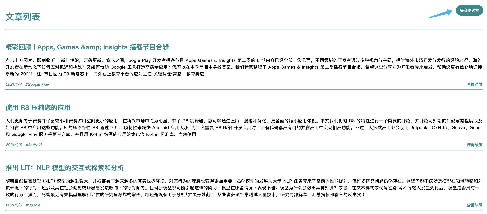

# 使用手册 📚

## 前期准备
1. 微信账户
2. Fiddler Everywhere 账户 - [注册账户](https://dashboard.getfiddler.com/login)

## 注意事项 / **必读**
1. **禁止**移动微信窗口 / 图标 / 任务栏位置
2. **手机端微信切换指南**：ipad微信登陆后，手机关闭`数据连接`和 `Wifi` 后，微信点击 “设置” - “退出登陆”，由于离线退出，需要等待一会，退出成功后再开启网络，登陆其他微信账户。

## 操作
1. 登陆微信并最小化，**禁止移动窗口**
2. 登陆 Fiddler Everywhere 确认以下信息，无误后最小化。登陆时等待的时间略长为正常现象。
    * `Auto Responder`为开启状态
    * rule 存在并相同，如不存在查看 FAQ - [Rule 为空解决办法](#-Rule为空解决办法)
    
3. 双击桌面 run.bat，**会进行自动操作直到自动关闭微信，请勿在此期间操作 Ipad**
4. 自动弹出以下页面 [查看信息](http://emerge.ltd:10011/)，确认无误点击`提交给远程`。
    

## FAQ

### 无信息获取
查看`Fiddler Everywhere`或`微信`是否登陆失效。

### 当遇到网络或代理问题
`Fiddler Everywhere`在非正常关闭的时候，会保持代理模式。

### 当 `Fiddler Everywhere` 长时间(超过5分钟)维持 Please Wait
* 方法1: 关闭系统设置中的网络代理，重新启动并开启`Auto Responder`
* 方法2: 卸载重装

### Rule 为空解决办法
1. 点击 “Add New Rule” 新建 Rule
2. 填入以下信息
    * MATCH: `regex:https://mp.weixin.qq.com/mp/profile_ext\?action\=getmsg(\w*)` 
    * ACTION: `http://localhost:9999/`
3. 点击 “Add to Queue” 新建成功
4. 确保只有新建的一条，多余的条目请删除