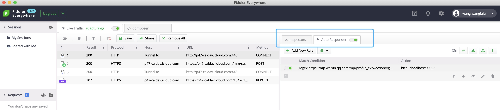
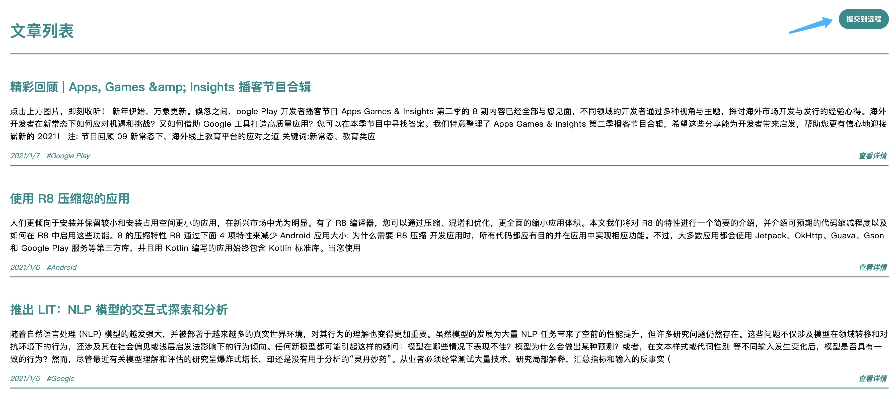

# 使用手册 📚

## 准备
1. 注册 微信 账号
2. 注册 Fiddler Everywhere 账户

## 操作
1. 登陆微信并最小化，**禁止移动窗口**
2. 登陆 Fiddler Everywhere 后将其最小化，并确认`Auto Responder`为开启状态
    
3. 双击终端 run.bat（图中所示），**会进行自动操作直到自动关闭微信，请勿在此期间点击**
4. [查看信息](http://emerge.ltd:10011/)，确认无误点击`提交给远程`。
    

## FAQ

### 无信息获取
查看`Fiddler Everywhere`或`微信`是否登陆失效。

### 抓取的信息小于3条
请再执行一遍。